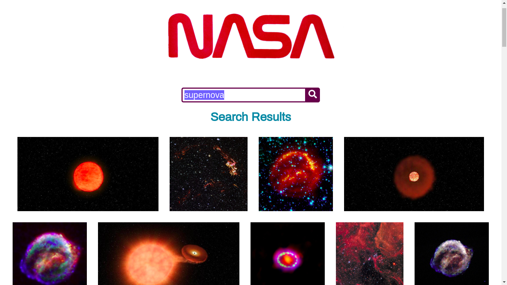

# Nasa Image Search App

The actual app has been deployed here:[link to app].

## The brief

The aim was to build a React web application that allows users to search for images based on a query relating to space.

The app had to include:

- A Search page which allows users to search for images by keyword
- Images must be returned upon a successful search

The NASA API endpoint for image search was provided:
GET​​ ​​https://images-api.nasa.gov/search ​Params: ​​q

A Nasa worm logo asset was provided, if I wished to use it:
https://cdn.cnn.com/cnnnext/dam/assets/200424060716-nasa-worm-logo.jpg

There was no specific rules on the styling, but it would be taken into consideration.

## Acknowledgement

This project was the React Developer Mock Tech Test project as part of the Manchester Codes curriculum.

## Finished app

This app was built using React.

Testing utilities used:

- [Jest](https://jestjs.io/)
- [React Testing Library](https://testing-library.com/docs/react-testing-library/intro)

Packages used:

- [Axios](https://www.npmjs.com/package/axios)
- [PropTypes](https://www.npmjs.com/package/prop-types)
- [React Icons Library](https://react-icons.github.io/react-icons/)

## How to run the app

Clone the repo.
npm start.
Launches the test runner in the interactive watch mode. 
See the section about [running tests](https://facebook.github.io/create-react-app/docs/running-tests) for more information.

## If I had more time...

### "About" page.

What the app is about.

### Image details

Each image will be clickable. Once you click, it would take you to another page, where the original size of the image and its details will be shown.

## Arianha Bayley
